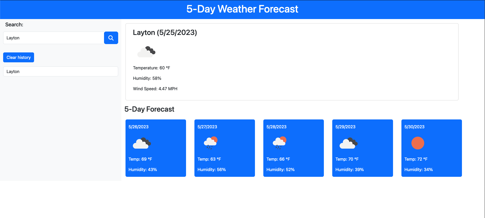

# 5-Day Weather Forecast App

The 5-Day Weather Forecast App is a simple web application that allows users to search for a city and view the current weather conditions as well as the 5-day forecast for that city. It also provides the functionality to save previously entered cities, which are stored in the browser's local storage.

# Features

City Search: Users can enter the name of a city in the provided input field and click the "Search" button to retrieve weather information for that city.

Current Weather: The app displays the current temperature and weather conditions for the searched city, including information such as temperature, humidity, wind speed, and weather icon representation.

5-day Forecast: The app provides a 5-day forecast for the searched city, showing the average temperature for each day.

Previous City Storage: The app stores the previously searched cities in the browser's local storage. When a user visits the app again, their previously searched cities will be displayed as buttons, allowing them to quickly access weather information for those cities.

# Technologies Used

    HTML
    Bootstrap
    Fontawesome
    JavaScript
    Weather API

# Demo

# Live Link

https://kyungkwon01.github.io/5-day-weather-forecast/
